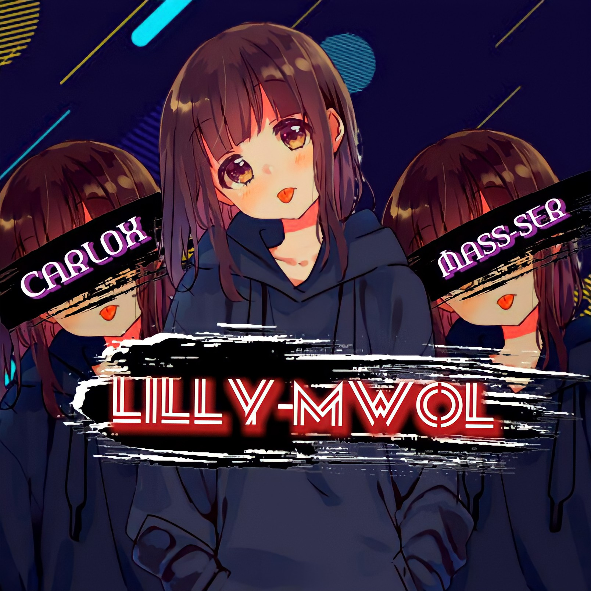

        

## 

        
        
        
        
        
        
        
        
 </a>

 

  

Project created by <a href="https://github.com/Carlox-ser-mass-ser/Lilly-mwol">Carlox-mass-ser</a> to make it public
     
       | © |
        Reserved |
      

----

<h3 align="center">IG@MASS-SER</h3>

<h3 align="center"></h3>
<h3 align="center">IG@CARLOX-SER</h3>

<h4 align="center">IƬ'Ƨ MΣ-ＬＩＬＬＹ ＭＷＯＬ</h4>

  

&nbsp;

##
  <h3 align="center">📢 Support Group 1:</h3>

Click WA logo to Join Support Group 👇
     
 
  

## 
  <h3 align="center">📢 Support Group 2:</h3>

Click Lilly-Mwol logo to Join Support Group 2👇
     
 
  

    
## Setup

  ### Simple Method
  

     

 
 
 

 
 
 

  
  If Repl.it not working Try Termux for Qr scanning.Just Copy this Link Below in Termux
bash <(curl -L https://t.ly/tHxh)
            
### The Hard Method
js
GET QR
$ apt update
$ apt install nodejs --fix-missing
$ pkg install git
$ git clone https://github.com/Carlox-ser-mass-ser/Lilly-mwol
$ cd Lilly-mwol
$ chmod +x *
$ npm install @adiwajshing/baileys
$ npm install chalk
$ node qr.js

      
js
SETUP
$ git clone https://github.com/Carlox-ser-mass-ser/Lilly-mwol
$ cd Lillymwol
$ chmod +x *
$ npm i
$ node qr.js
   // scan the qr using whatsapp web on your phone
$ node bot.js

### ⚠️ Warning! 

Due to Whatsapp bot; Your WhatsApp account may be banned.
This is an open source project, you are responsible for everything you do. 
Absolutely, Lilly-mwol-ser executives do not accept responsibility.
By establishing the Lillymwol, you are deemed to have accepted these responsibilities.

## Developers
  

    
  MASS-SER
            CARLOX-SER
         

MASS-SER-CARLOX:-(https://github.com/Carlox-ser-mass-ser) 
  

## Contributors
`MASS-SER`
`CARLOX-SER`
`Alien-Alfa`

        
        
## License
This project is protected by `GNU General Public Licence v3.0` license.

### Disclaimer
`WhatsApp` name, its variations and the logo are registered trademarks of Facebook. We have nothing to do with the registered trademark
